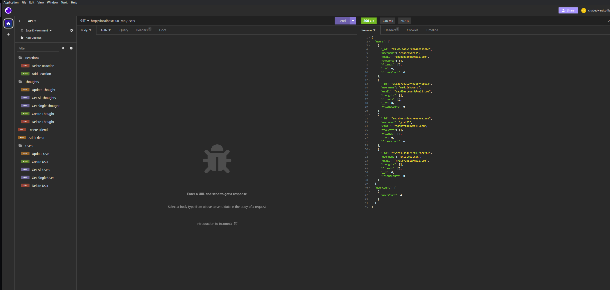

# Social Network API
  - Application Screenshot : 
  
  ## Description
  This application is created to serve as a baseline demonstration for a Social Network API database using No SQL Routes. 
  
  ## Table of Contents
  - [Installation](#installation)
  - [Contributing](#contributing)
  - [Questions](#questions)
  
  ## Installation
  Any user can clone the repository provided here "https://github.com/chadedwardsofficial/Social-Network-API".
  
  
  ## Demo
  - Application Video : https://drive.google.com/file/d/15R8a21XI2WqRwRJQ-O9QMwKf3ljK1apW/view
  

  
  ## Contributing
  Contributors were express mongoose and node packages.

  ## Questions
  My email [chadedwardsofficial@gmail.com](mailto:chadedwardsofficial@gmail.com). You can also find me on [GitHub](https://github.com/chadedwardsofficial).
  